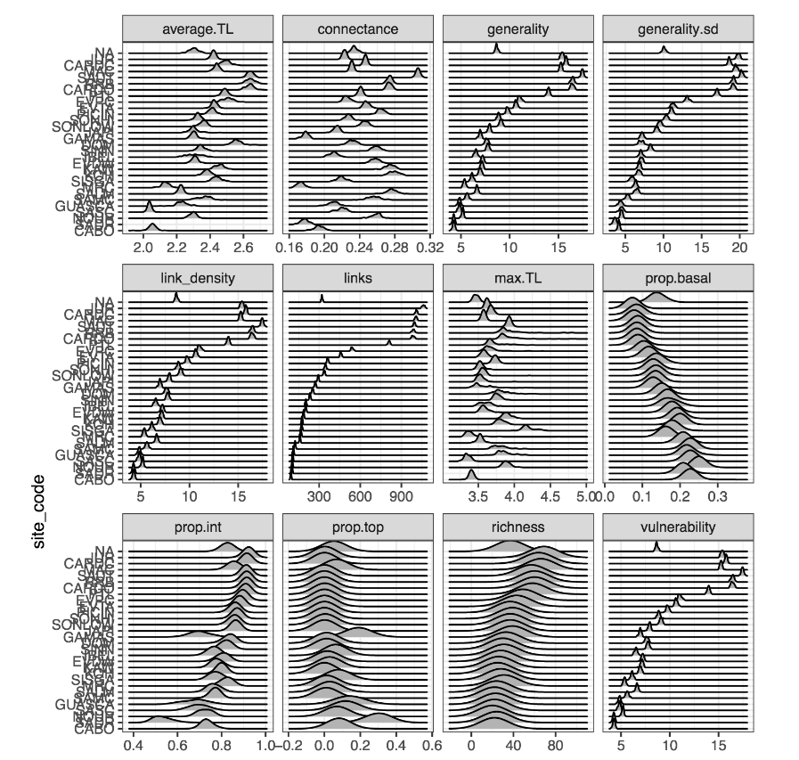

```{r setup, echo=FALSE}
knitr::opts_chunk$set(
  echo = FALSE,
  message = FALSE,
  warning = FALSE
)
```

```{r load packages, include = FALSE}
ipak <- function(pkg){
    new.pkg <- pkg[!(pkg %in% installed.packages()[, "Package"])]
    if (length(new.pkg)) 
        install.packages(new.pkg, dependencies = TRUE)
    sapply(pkg, require, character.only = TRUE)
}

packages <- c("dplyr", "tibble", "purrr", "adespatial", "tidyr", "ggplot2", "readr", "cowplot", "vegan", "tidyverse", "here", "ggridges", "cheddar")
ipak(packages)
```

```{r get data ready}
## bromeliad data
site_codes <- 
  readr::read_csv("../empirical_food_webs/probabilistic_matrices/site_codes.csv")

# Get species composition of each bromeliad
abd_data <- 
  readr::read_csv("../empirical_food_webs/01_combined_food_web/data/abundance_cleaned.csv")

# bromeliad lookup table
brm_data <- 
  readr::read_csv("../empirical_food_webs/01_combined_food_web/data/bromeliads_cleaned.csv")
    

##### get webs ####

source("../empirical_food_webs/03_food_web_metrics/food_web_functions.R")

# Find the data folder using the `here` package
filenames <- 
  list_site_matrices2(data_folder = "../empirical_food_webs/03_food_web_metrics/data/pasted_matrices/")

# read in all probability matrices as a list
prob_mat_list <- read_prob_matrices(filenames)


site_bromeliad_level_composition <- readr::read_rds("../empirical_food_webs/03_food_web_metrics/data/site_bromeliad_level_composition.rds")


# store prob mat list in a data frame

prob_mat_df <- enframe(prob_mat_list,
                       name = "site_code",
                       value = "prob_mat")


sub_mats_df <- site_bromeliad_level_composition %>% 
  left_join(prob_mat_df) %>% 
  mutate(sub_mats = map2(composition, prob_mat, subset_mat))

```


## Context

1. Special things about the database:  
    a) **Small scale and large scale** sampling, allowing micro and macroecological analyses. We have bromeliads systems along continental scales - we can test micro and macroclimate effects on species composition, and compare local and continental beta-diversity.  
    b) Although **we can not assess beta-diversity of interactions**, we have a good amount of information and results about the relationship between body mass and predation to try and simulate scenarions of varying interactions.

### What do we know about this system
1. No turnover of interactions - **interactions assumed from co-occurrence**
2. Forbidden links - registered on the dataset, results from literature search. 
3. Results from previous work of sCaleWebs:
    a) Richer bromeliads have more links per species, as we can see in this plot authored by [@aammd](https://github.com/aammd):

```{r links per species}
bromeliad_all <- read_csv(here::here("../empirical_food_webs/03_food_web_metrics", 
           "data", 
           "bromeliad_level_all_metrics.csv"))
bromeliad_basic <- read_csv(here::here("../empirical_food_webs/03_food_web_metrics", 
           "data", 
           "bromeliad_level_basic_metrics.csv"))

bromeliad_basic %>% 
  ggplot(aes(x = richness,
             y = links/richness,
             colour = site_code)) + 
  geom_point(position = position_jitter(width = .2)) + 
  scale_colour_viridis_d(guide = FALSE)
```

This is very likely the result of the presence of generalist predators in richer communities, as we can see in this plot authored by [@pierrerogy](https://github.com/pierrerogy): 


*This plot couldn't be reproduced, so I pasted a screenshot from this [PDF file](https://github.com/SrivastavaLab/empirical_food_webs/blob/main/dreamzone/modelling_links.pdf).*

## Interesting questions

Many interesting questions came up from our discussions about species and interactions turnover between bromeliads and sites. As we can not evaluate interactions turnover because all interactions are inferred from co-occurrence (in this way, a turnover in species composition necessarily leads to a turnover on interactions), our questions needed to be restricted to those related to species composition, network metrics (also dependent on species composition) and number of links associated with each species.

In this sense, we decided to explore the following questions:

### Species richness and out-degrees

We hypothesized that species richness would be inversely proportional to number of links per species. The rationale behind that is that bromeliads with more species would experiece more niche partitioning, and so we would observe more predators interacting with a smaller subset of preys. However, as mentioned above, we could expect this relationship to be the opposite due to the higher probablity of recruitment of generalist predators in richer communities.

In a related result, the plot below, authored by [@lmguzman](https://github.com/lmguzman), illustrates how the most generalist species contribute less to the composition of local communities, which means they are present in more bromeliads than specialists (as expected); on the other hand, specialist species contribute much more to composition, which might mean that their turn over is more sensitive to local environmental conditions.

```{r}
source("code/01_get_link_abundance.R")

mantel_contribution_degree %>% 
  ggplot(aes(x = degree, y = z_score)) +
  geom_point() +
  geom_smooth(method = "lm") +
  facet_wrap(~site_code, scales = 'free') 
```


### Degrees and environment

To further investigate the relationship between degrees and environmental filtering, 

